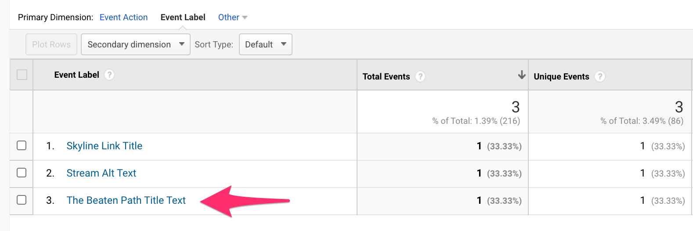

# Link Helper Plugin for Divi

This is a WordPress plugin that will insert missing title attributes for image links. Having a title attribute for links helps with Google Analytics link tracking for themes like Divi.

---

## Description

Once installed and activated, this plugin will automatically insert a title attribute for any image links that don't have one.. 

Since image links don't have text as the link (hence image link), some Google Analytics trackers will fallback to a title attribute in the HTML link element. If the link has no title attribute, then the image link either won't get tracked, or it it does, it will display a non-meaningful label for the link event (e.g., Label not set or the HTML code for the child image element).

Some WordPress themes/page builders (such as Divi) don't set a title attribute for image links. Furthermore, they don't provide a way through the UI to insert a title attribute value pair.

The Link Helper Divi plugin automatically finds those cases and will insert a title attribute using the child image's title or the alt text as the fallback.

Below is what we want to avoid and what this plugin will fix for you.


---

## Installation and Usage

1. Install the plugin through the WordPress plugins page directly (recommended), or manually upload the **contents** of plugin zip file to the /wp-content/plugins/link-helper-divi directory.
2. Activate the plugin through the 'Plugins' page.
3. Once installed and activated, the plugin runs automatically for all pages on your WordPress site.
4. There is a `link_helper_selector` filter available if you want to use this plugin for other themes/page builders.

### Example link_helper_selector Filter

```php
function my_link_helper_query_selector($query_selector) {
    return '.some-test-class';
}
add_filter( 'link_helper_selector', 'my_link_helper_query_selector' );
```

---

## Example Divi Source Code

The Link Helper Divi plugin was originally designed to work with Divi, but it can work with any theme or plugin that follows the same HTML structure (e.g., link > wrapper (span/div) > image).

The source code below is based of [Divi's Image Module](https://www.elegantthemes.com/preview/Divi/image/) page visited in October 2020.

### Default

No link title set.

```html
<a href="https://www.elegantthemes.com/preview/Divi/wp-content/uploads/2014/04/beaten-path.jpg" class="et_pb_lightbox_image" title="">
  <span class="et_pb_image_wrap ">
    
  </span>
</a>
```

### After Link Helper Divi is Activated

Link title is set to the image title.

```html
<a href="https://www.elegantthemes.com/preview/Divi/wp-content/uploads/2014/04/beaten-path.jpg" class="et_pb_lightbox_image" title="The Beaten Path Title Text">
  <span class="et_pb_image_wrap ">
    
  </span>
</a>
```

### Result in Google Analytics Top Events Report 



Visit the [live demo](http://caughtmyeye.epizy.com/divi-image-test/).
